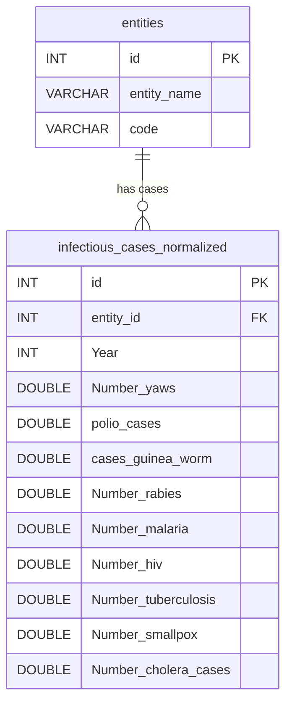
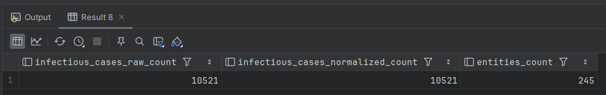
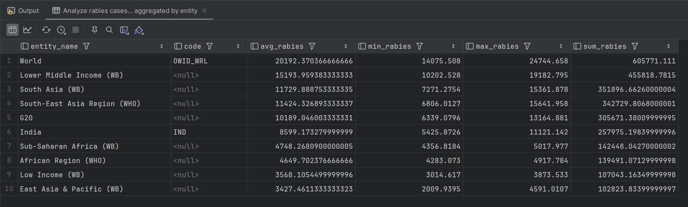
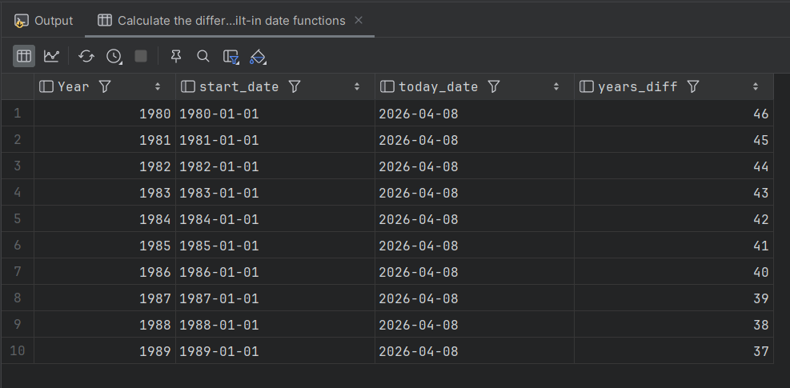
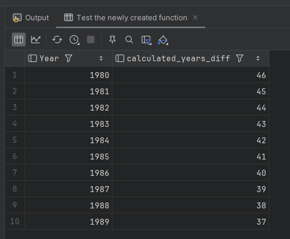

# Final Project: Relational Databases

This folder contains the SQL scripts and documentation for the final project on Relational Databases university course. The goal of this project is to create a database schema, import raw data, normalize it to the Third Normal Form (3NF), perform data analysis, and build custom SQL functions.

## Rationale and Decision Making

### DDL Extraction from Test Data

Looking at the provided dataset (`infectious_cases.csv`), we can observe different data types.

- `Entity` and `Code` are string values.

- `Year` is a standard integer.

- The disease case columns (e.g., `Number_rabies`) contain floating-point numbers (e.g., `2.145772`). To prevent data truncation during the import wizard process, I selected `DOUBLE` data types for all case metrics instead of `INT`.

## Normalization to 3NF

In the original flat table, the `Code` attribute strictly depends on the `Entity` attribute (e.g., "Afghanistan" always has the code "AFG"). Storing them repeatedly alongside the yearly disease data violates the Third Normal Form (3NF) due to a transitive dependency.
To resolve this, I separated the data into two tables:

- `entities`: Stores unique countries/regions and their codes.

- `infectious_cases_normalized`: Stores the disease statistics and references the `entities` table using a Foreign Key (`entity_id`).

### ER Diagram of the normalized schema




## SQL Implementation

### Step 1: Database Setup and Raw Data DDL

First, we create the schema and the raw table structure matching the CSV file.

```sql
-- Create the schema and set it as default
CREATE SCHEMA IF NOT EXISTS pandemic;
USE pandemic;

-- Create the raw table for initial data import
CREATE TABLE IF NOT EXISTS infectious_cases_raw (
    Entity VARCHAR(255),
    Code VARCHAR(10),
    Year INT,
    Number_yaws DOUBLE,
    polio_cases DOUBLE,
    cases_guinea_worm DOUBLE,
    Number_rabies DOUBLE,
    Number_malaria DOUBLE,
    Number_hiv DOUBLE,
    Number_tuberculosis DOUBLE,
    Number_smallpox DOUBLE,
    Number_cholera_cases DOUBLE
);
```
After creation of a `infectious_cases_raw` table we should import a CSV data into it using Import Wizard.


### Step 2: Normalization (3NF)

We divide the raw table into two related tables to eliminate data redundancy.

```sql
-- Create the entities table to store unique locations
CREATE TABLE IF NOT EXISTS entities (
    id INT AUTO_INCREMENT PRIMARY KEY,
    entity_name VARCHAR(255) NOT NULL,
    code VARCHAR(10)
);

-- Extract unique entities and codes from the raw data
INSERT INTO entities (entity_name, code)
SELECT DISTINCT Entity, Code
FROM infectious_cases_raw;

-- Create the normalized table for disease statistics
CREATE TABLE IF NOT EXISTS infectious_cases_normalized (
    id INT AUTO_INCREMENT PRIMARY KEY,
    entity_id INT,
    Year INT,
    Number_yaws DOUBLE,
    polio_cases DOUBLE,
    cases_guinea_worm DOUBLE,
    Number_rabies DOUBLE,
    Number_malaria DOUBLE,
    Number_hiv DOUBLE,
    Number_tuberculosis DOUBLE,
    Number_smallpox DOUBLE,
    Number_cholera_cases DOUBLE,
    FOREIGN KEY (entity_id) REFERENCES entities(id)
);

-- Populate the normalized table by joining raw data with the new entities table
INSERT INTO infectious_cases_normalized (
    entity_id, Year, Number_yaws, polio_cases, cases_guinea_worm, 
    Number_rabies, Number_malaria, Number_hiv, Number_tuberculosis, 
    Number_smallpox, Number_cholera_cases
)
SELECT 
    e.id, r.Year, r.Number_yaws, r.polio_cases, r.cases_guinea_worm, 
    r.Number_rabies, r.Number_malaria, r.Number_hiv, r.Number_tuberculosis, 
    r.Number_smallpox, r.Number_cholera_cases
FROM infectious_cases_raw r
JOIN entities e 
  ON r.Entity = e.entity_name 
  AND (r.Code = e.code OR (r.Code IS NULL AND e.code IS NULL));

-- Verify the number of imported records
SELECT COUNT(*) AS total_records FROM infectious_cases_raw;
```

Now let's count the records in all created tables after importing and normalizing the data:
```sql
-- Count the number of records in each table
SELECT
    (SELECT COUNT(*) FROM infectious_cases_raw) AS infectious_cases_raw_count,
    (SELECT COUNT(*) FROM infectious_cases_normalized) AS infectious_cases_normalized_count,
    (SELECT COUNT(*) FROM entities) AS entities_count;
```

#### Result of the SQL query execution




### Step 3: Data Analysis

Calculate the average, minimum, maximum, and sum of rabies cases for each entity, ignoring empty/null values, and displaying the top 10 results.

```sql
-- Analyze rabies cases aggregated by entity
SELECT 
    e.entity_name,
    e.code,
    AVG(n.Number_rabies) AS avg_rabies,
    MIN(n.Number_rabies) AS min_rabies,
    MAX(n.Number_rabies) AS max_rabies,
    SUM(n.Number_rabies) AS sum_rabies
FROM infectious_cases_normalized n
JOIN entities e ON n.entity_id = e.id
WHERE n.Number_rabies IS NOT NULL 
GROUP BY e.entity_name, e.code
ORDER BY avg_rabies DESC
LIMIT 10;
```

#### Result of the SQL query execution




### Step 4: Date Calculations

Construct a date from the Year attribute and calculate the difference in years compared to today.

```sql
-- Calculate the difference in years using built-in date functions
SELECT 
    Year,
    MAKEDATE(Year, 1) AS start_date,
    CURDATE() AS today_date,
    TIMESTAMPDIFF(YEAR, MAKEDATE(Year, 1), CURDATE()) AS years_diff
FROM infectious_cases_normalized
LIMIT 10;
```

#### Result of the SQL query execution




### Step 5: Custom SQL Function

Create a reusable User-Defined Function (UDF) that encapsulates the logic from Step 4.

```sql
-- Change delimiter to create the function properly
DELIMITER //

-- Drop the function if it already exists to prevent errors
DROP FUNCTION IF EXISTS GetYearsDifference //

-- Create a function that takes a year and returns the difference in years
CREATE FUNCTION GetYearsDifference(input_year INT) 
RETURNS INT
DETERMINISTIC
BEGIN
    RETURN TIMESTAMPDIFF(YEAR, MAKEDATE(input_year, 1), CURDATE());
END //

-- Reset delimiter back to default
DELIMITER ;

```

Now test the newly created function:
```sql
SELECT 
    Year,
    GetYearsDifference(Year) AS calculated_years_diff
FROM infectious_cases_normalized
LIMIT 10;
```

#### Result of the SQL query execution

