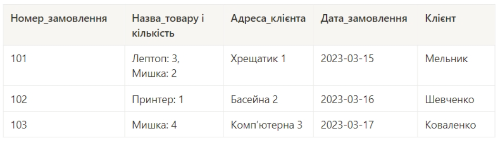
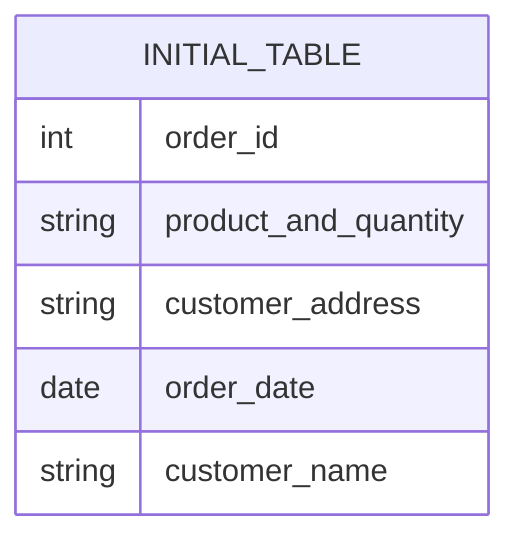
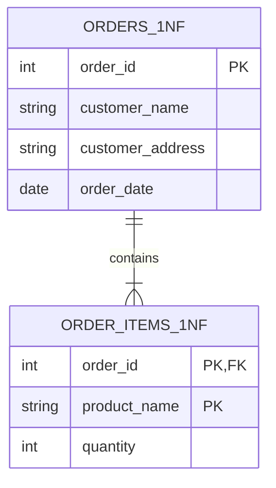
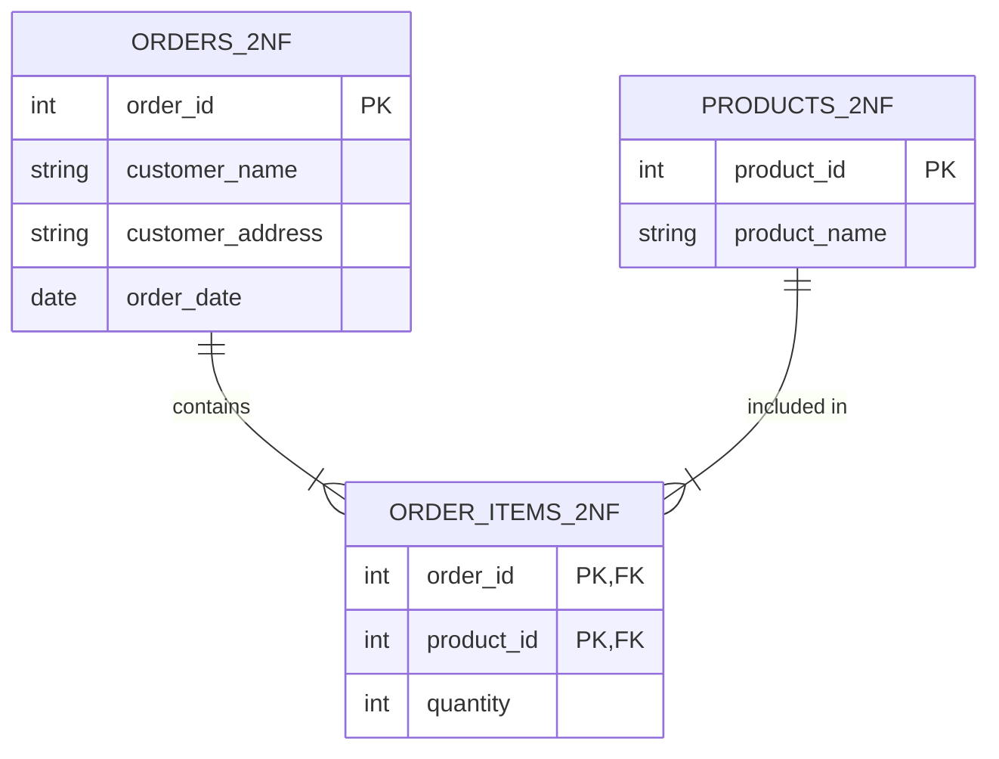
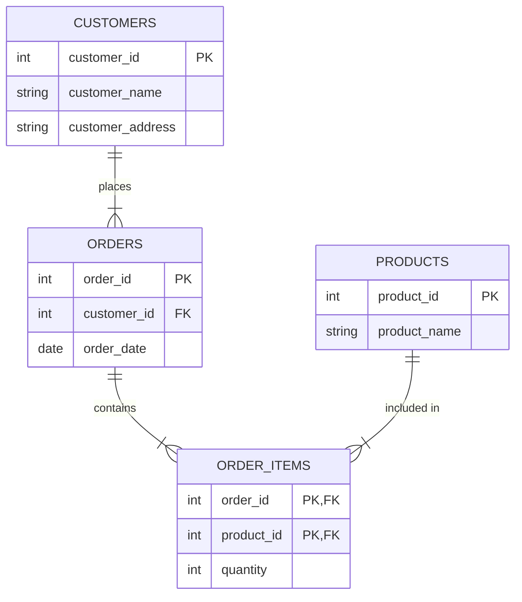
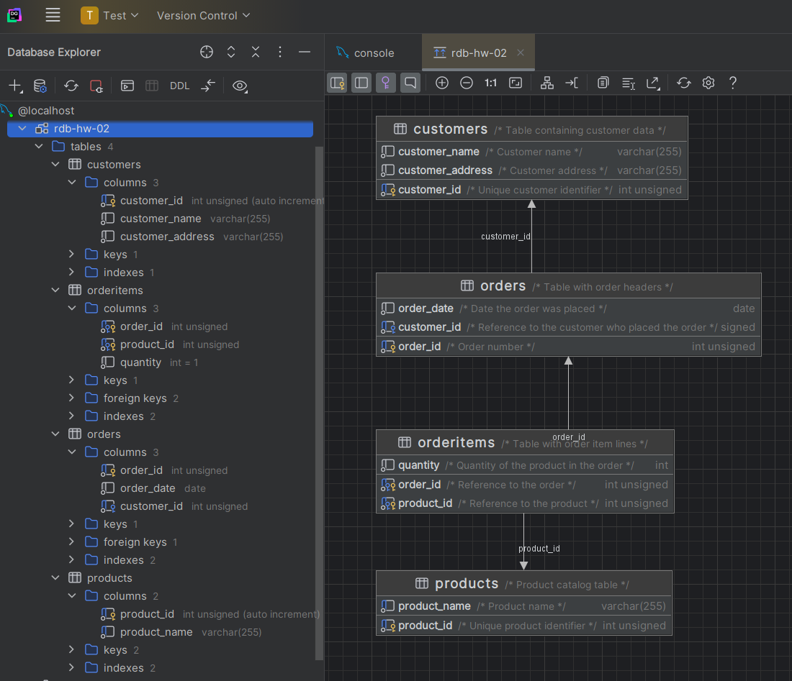

# HW #2: Relational Database Normalization

## Normalization Process

Below is the step-by-step breakdown of how the initial data was transformed to eliminate data redundancy and ensure data integrity.

### Step 0: Initial Unnormalized Table (UNF)
The original table contained all data in a single view. It violated basic database principles because the `Product Name and Quantity` column contained multiple values (composite attributes).

#### Screenshot of the initial table:


#### ER Diagram of the initial table:

---

### Step 1: First Normal Form (1NF)
**Goal:** Eliminate repeating groups and composite attributes.

**Action:** We separated the order headers from the order items. The composite product string was broken down into individual rows, linking each product and its quantity to a specific order ID.



---

### Step 2: Second Normal Form (2NF)
**Goal:** Eliminate partial dependencies.

**Action:** In the order items table, the product name only depended on a part of the composite key. We extracted the products into a dedicated `Products` table. Now, the order items table only uses foreign keys to reference products.



---

### Step 3: Third Normal Form (3NF)
**Goal:** Eliminate transitive dependencies.

**Action:** In the orders table, the customer's address depended on the customer's name, not the order ID. We extracted the customer details into a new `Customers` table. The orders table now simply references the customer ID.



---

## Final DDL Script (MySQL)
The following script generates the final normalized schema in a MySQL database based on the 3NF.

```sql
-- 1. Customers Table
CREATE TABLE IF NOT EXISTS `Customers` (
    `customer_id` INT UNSIGNED AUTO_INCREMENT PRIMARY KEY COMMENT 'Unique customer identifier',
    `customer_name` VARCHAR(255) NOT NULL COMMENT 'Customer name',
    `customer_address` VARCHAR(255) NOT NULL COMMENT 'Customer address'
) ENGINE=InnoDB DEFAULT CHARSET=utf8mb4 COMMENT='Table containing customer data';

-- 2. Products Table
CREATE TABLE IF NOT EXISTS `Products` (
    `product_id` INT UNSIGNED AUTO_INCREMENT PRIMARY KEY COMMENT 'Unique product identifier',
    `product_name` VARCHAR(255) NOT NULL UNIQUE COMMENT 'Product name'
) ENGINE=InnoDB DEFAULT CHARSET=utf8mb4 COMMENT='Product catalog table';

-- 3. Orders Table
CREATE TABLE IF NOT EXISTS `Orders` (
    `order_id` INT UNSIGNED PRIMARY KEY COMMENT 'Order number',
    `order_date` DATE NOT NULL COMMENT 'Date the order was placed',
    `customer_id` INT UNSIGNED NOT NULL COMMENT 'Reference to the customer who placed the order',
    CONSTRAINT `fk_orders_customer` FOREIGN KEY (`customer_id`)
        REFERENCES `Customers` (`customer_id`)
        ON DELETE RESTRICT ON UPDATE CASCADE
) ENGINE=InnoDB DEFAULT CHARSET=utf8mb4 COMMENT='Table with order headers';

-- 4. Order Items Table
CREATE TABLE IF NOT EXISTS `OrderItems` (
    `order_id` INT UNSIGNED NOT NULL COMMENT 'Reference to the order',
    `product_id` INT UNSIGNED NOT NULL COMMENT 'Reference to the product',
    `quantity` INT NOT NULL DEFAULT 1 COMMENT 'Quantity of the product in the order',
    PRIMARY KEY (`order_id`, `product_id`),
    CONSTRAINT `fk_items_order` FOREIGN KEY (`order_id`)
        REFERENCES `Orders` (`order_id`)
        ON DELETE CASCADE ON UPDATE CASCADE,
    CONSTRAINT `fk_items_product` FOREIGN KEY (`product_id`)
        REFERENCES `Products` (`product_id`)
        ON DELETE RESTRICT ON UPDATE CASCADE
) ENGINE=InnoDB DEFAULT CHARSET=utf8mb4 COMMENT='Table with order item lines';
```

## Schema Verification
To prove that the DDL executes successfully and creates the correct relationships, below is the screenshoot of created tables together with auto-generated Entity-Relationship diagram exported directly from **JetBrains DataGrip** after running the script.

