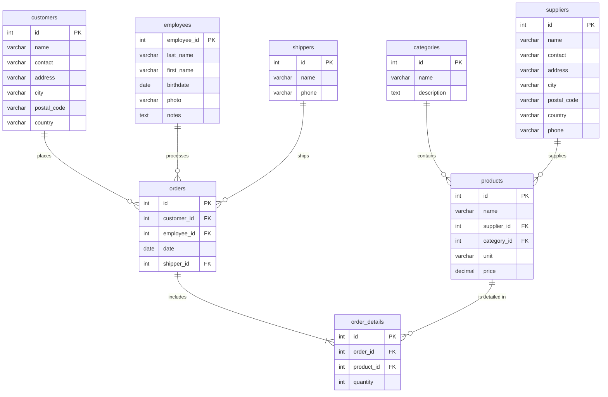
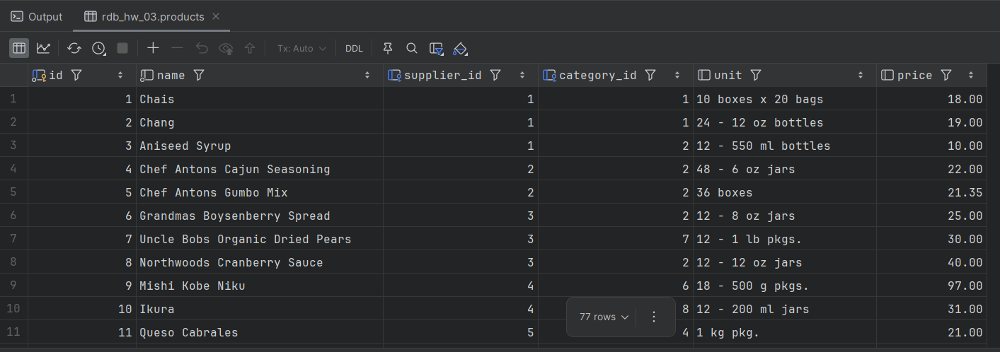
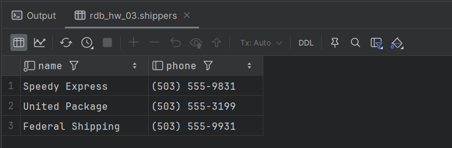
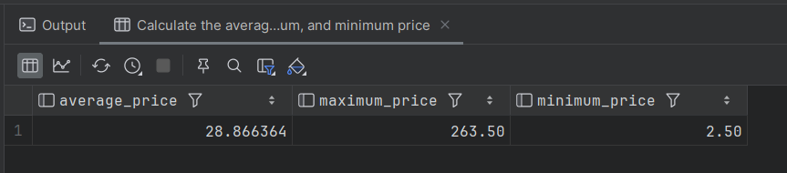
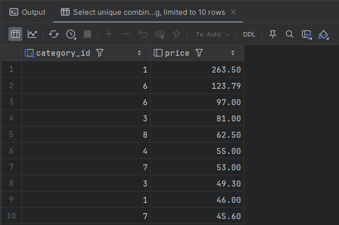
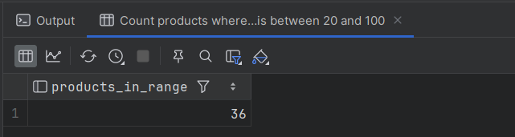
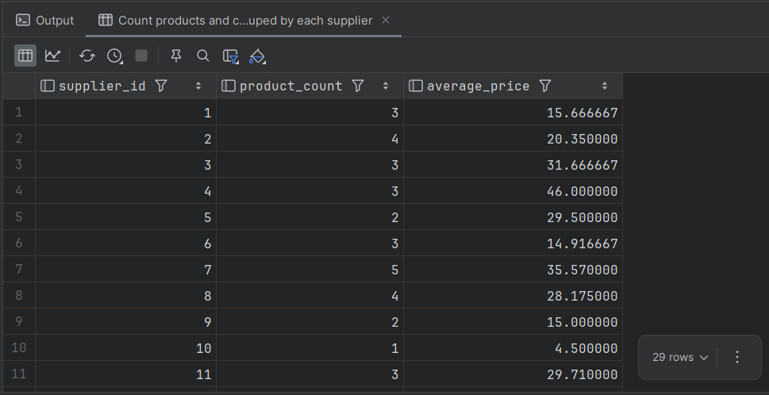

# HW #3: SQL Database Setup and Basic Queries

## Introduction

In order to better understand the database, the Data Definition Language (DDL) file used to create the tables was composed based on the analysis of the provided CSV files from the dataset. 

You can find the SQL script used to create the database schema here: [create_tables_ddl.sql](./create_tables_ddl.sql).

An Entity-Relationship (ER) diagram was also created to visualize the database structure and the relationships between the tables.



---

## Task 1: Very basic SQL queries

**Description:** 
Write an SQL command to select all columns (using the wildcard “*”) from the `products` table and select only the `name`, `phone` columns from the `shippers` table.

**SQL Code:**
```sql
-- Select all columns from the products table
SELECT * FROM products;

-- Select only name and phone columns from the shippers table
SELECT name, phone FROM shippers;
```
#### Screenshot of the query results:




## Task 2: Query with aggregation functions

**Description:**
Write an SQL command to find the *average*, *maximum* and *minimum* values of the `price` column of the `products` table.

**SQL Code:**
```sql
-- Calculate the average, maximum, and minimum price
SELECT 
    AVG(price) AS average_price,
    MAX(price) AS maximum_price,
    MIN(price) AS minimum_price
FROM products;
```
#### Screenshot of the query result:



## Task 3: Query with unique, ordered, and limited output

**Description:**
Write an SQL command to select unique values of the `category_id` and price columns of the `products` table. Choose the output order in descending order of the `price` value and select only 10 rows.

**SQL Code:**
```sql
-- Select unique combinations of category_id and price
SELECT DISTINCT category_id, price 
FROM products 
ORDER BY price DESC 
LIMIT 10;
```
#### Screenshot of the query result:



## Task 4: Query that counts items in specific range

**Description:**
Write an SQL command to find the number of products (rows) that are in the price range from 20 to 100.

**SQL Code:**
```sql
-- Count products where the price is between 20 and 100
SELECT COUNT(*) AS products_in_range 
FROM products 
WHERE price BETWEEN 20 AND 100;
```
#### Screenshot of the query result:



## Task 5: Query with grouping and agregation

**Description:**
Write an SQL command to find the number of products (rows) and the average price (`price`) for each supplier (`supplier_id`).

**SQL Code:**
```sql
-- Count products and calculate the average price grouped by each supplier
SELECT 
    supplier_id, 
    COUNT(*) AS product_count, 
    AVG(price) AS average_price 
FROM products 
GROUP BY supplier_id;
```
#### Screenshot of the query result:



## Conclusion

In this homework, we successfully practiced translating raw data requirements (CSV files) into a structured relational database schema using DDL statements. We established correct primary and foreign key relationships to maintain data integrity. Furthermore, we gained hands-on experience writing fundamental SQL queries, which included data retrieval, utilizing aggregate functions (like `MIN`, `MAX`, `AVG`, `COUNT`), filtering records with the `BETWEEN` operator, removing duplicates with DISTINCT, sorting results with `ORDER BY`, and organizing analytical data using the `GROUP BY` clause. This provides a strong foundation for managing and analyzing relational data.

