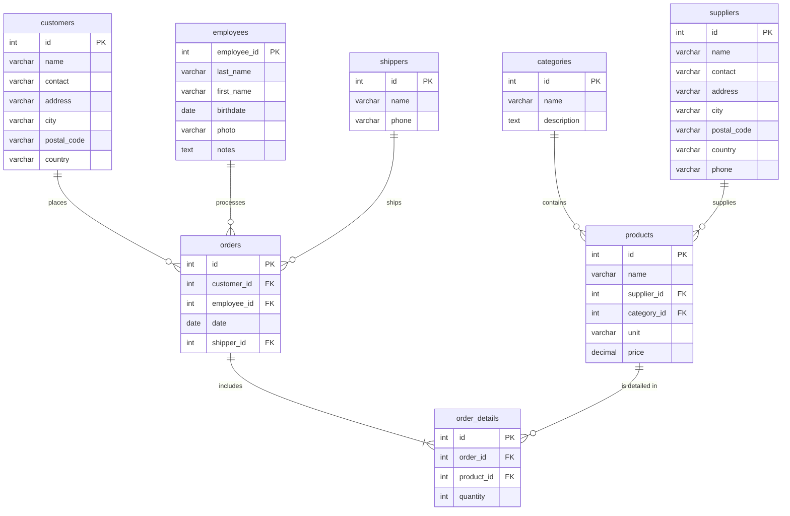

## ER Diagram

```mermaid
%% Database Entity-Relationship Diagram for imported CSV data
%% Defining entities and their relationships

erDiagram
    categories {
        int id PK
        varchar name
        text description
    }
    
    customers {
        int id PK
        varchar name
        varchar contact
        varchar address
        varchar city
        varchar postal_code
        varchar country
    }
    
    employees {
        int employee_id PK
        varchar last_name
        varchar first_name
        date birthdate
        varchar photo
        text notes
    }
    
    shippers {
        int id PK
        varchar name
        varchar phone
    }
    
    suppliers {
        int id PK
        varchar name
        varchar contact
        varchar address
        varchar city
        varchar postal_code
        varchar country
        varchar phone
    }
    
    products {
        int id PK
        varchar name
        int supplier_id FK
        int category_id FK
        varchar unit
        decimal price
    }
    
    orders {
        int id PK
        int customer_id FK
        int employee_id FK
        date date
        int shipper_id FK
    }
    
    order_details {
        int id PK
        int order_id FK
        int product_id FK
        int quantity
    }

    %% Defining relationships (Foreign Keys)
    categories ||--o{ products : "contains"
    suppliers ||--o{ products : "supplies"
    customers ||--o{ orders : "places"
    employees ||--o{ orders : "processes"
    shippers ||--o{ orders : "ships"
    orders ||--|{ order_details : "includes"
    products ||--o{ order_details : "is detailed in"
```