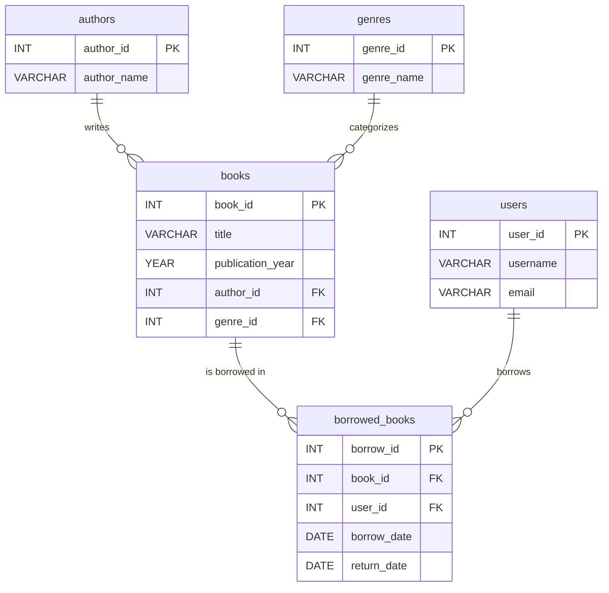
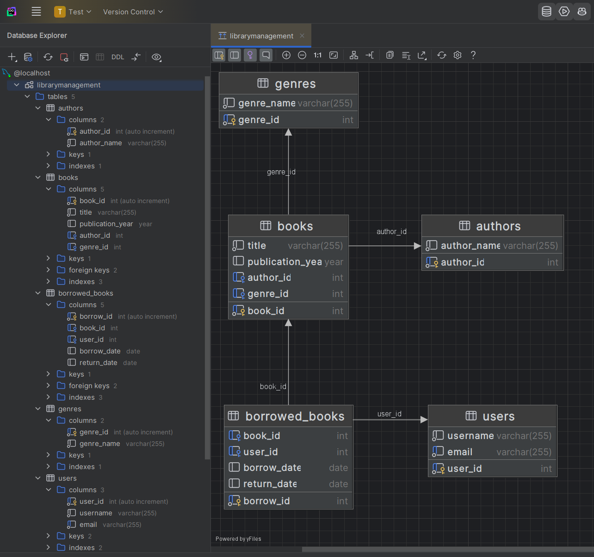
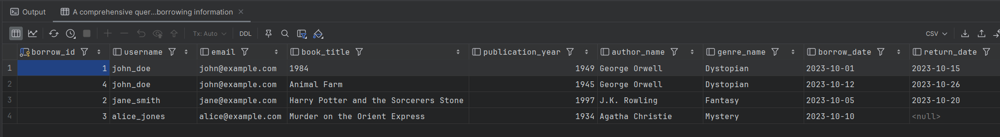
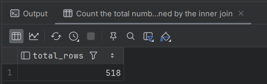
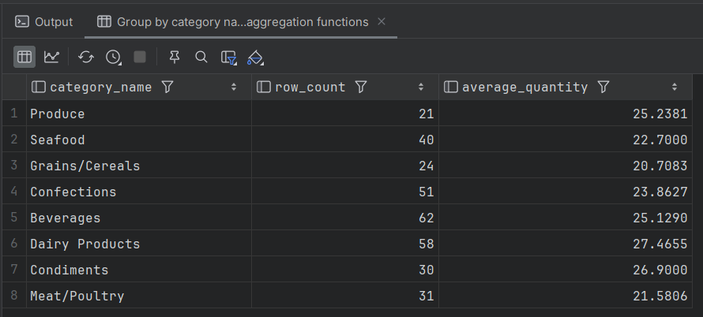
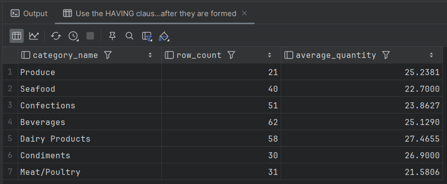
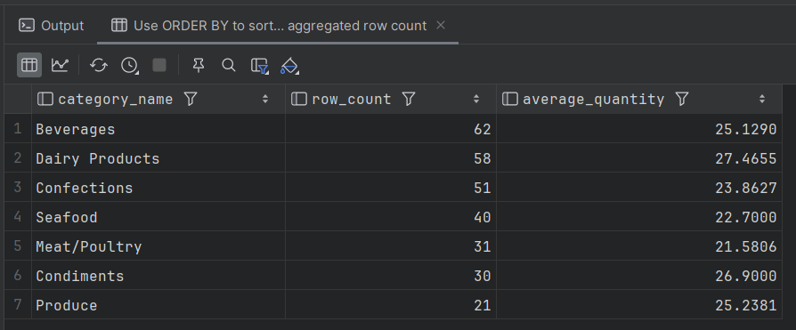
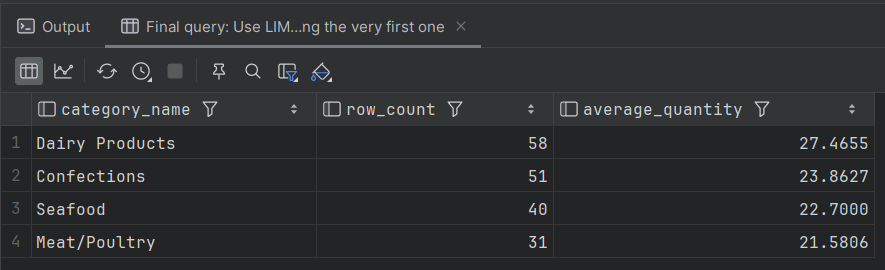

# HW #4: DDL/DML Commands and Complex SQL Queries

## Part 1. New Database Creation
A new schema named `LibraryManagement` was created. Tables for `authors`, `genres`, `books`, `users`, and `borrowed_books` were successfully created using DDL commands.

### DDL Script
Here is the complete DDL script used for schema creation:
[create_tables_ddl.sql](./create_tables_ddl.sql).

### ER-Diagram of the created schema


### Screenshoot of the created tables with generated ER-Diagram


## Part 2. Sample Data Insertion
Database was populated with the sample data using this script:
[insert_sample_data.sql](./insert_sample_data.sql).

### SQL script to test the database after sample data insertion:
```sql
SELECT 
    bb.borrow_id,
    u.username,
    u.email,
    b.title AS book_title,
    b.publication_year,
    a.author_name,
    g.genre_name,
    bb.borrow_date,
    bb.return_date
FROM 
    borrowed_books bb
JOIN 
    users u ON bb.user_id = u.user_id
JOIN 
    books b ON bb.book_id = b.book_id
LEFT JOIN 
    authors a ON b.author_id = a.author_id
LEFT JOIN 
    genres g ON b.genre_id = g.genre_id;
```

### Result produced by this query



## Part 3. Joined Query to the Previous Database
Here we return to the database from the [previous homework](../rdb-hw-03/README.md) in order to create some new queries from it.

### SQL Query
```sql
-- Select all columns from the fully joined database structure
SELECT *
FROM order_details od
-- Join orders to get order information
INNER JOIN orders o ON od.order_id = o.id
-- Join customers to see who placed the order
INNER JOIN customers c ON o.customer_id = c.id
-- Join employees to see who processed the order
INNER JOIN employees e ON o.employee_id = e.employee_id
-- Join shippers to see how the order was shipped
INNER JOIN shippers sh ON o.shipper_id = sh.id
-- Join products to get details about the ordered items
INNER JOIN products p ON od.product_id = p.id
-- Join categories to see the category of each product
INNER JOIN categories cat ON p.category_id = cat.id
-- Join suppliers to see who supplied each product
INNER JOIN suppliers sup ON p.supplier_id = sup.id;
```

This query returned to many rows in the result (500+) according to my DataGrip indication


## Part 4. Other SQL Queries to the Previous Database
This section contains some other queries related to the [previous database](../rdb-hw-03/README.md)

### 4.1. Count the number of the previously produced rows
**Task:** Determine how many rows you got (using the `COUNT` operator).

**Solution:**
```sql
-- Count the total number of rows returned by the inner join
SELECT COUNT(*) AS total_rows
FROM order_details od
INNER JOIN orders o ON od.order_id = o.id
INNER JOIN products p ON od.product_id = p.id
INNER JOIN customers c ON o.customer_id = c.id
INNER JOIN employees e ON o.employee_id = e.employee_id
INNER JOIN shippers sh ON o.shipper_id = sh.id
INNER JOIN categories cat ON p.category_id = cat.id
INNER JOIN suppliers sup ON p.supplier_id = sup.id;
```

### Result produced by this query



### 4.2. Change INNER JOIN to LEFT or RIGHT
**Task:** Change some `INNER` operators to `LEFT` or `RIGHT`. Determine what happens to the number of rows.

**Solution:**
```sql
-- Example changing some INNER JOINs to LEFT JOINs
SELECT COUNT(*) AS total_rows_left_join
FROM order_details od
LEFT JOIN orders o ON od.order_id = o.id
LEFT JOIN products p ON od.product_id = p.id
LEFT JOIN customers c ON o.customer_id = c.id
LEFT JOIN employees e ON o.employee_id = e.employee_id
LEFT JOIN shippers sh ON o.shipper_id = sh.id
LEFT JOIN categories cat ON p.category_id = cat.id
LEFT JOIN suppliers sup ON p.supplier_id = sup.id;
```

### Result produced by this query
Query produced exactly the same number of rows, as the prewious one (518)

### Explanation
When you change an `INNER JOIN` to a `LEFT JOIN` (or `RIGHT JOIN`), the total number of rows will either stay the same or increase.

Why? An `INNER JOIN` strictly requires a match in both tables to include a row in the result. A `LEFT JOIN`, however, will return all rows from the left (first) table, even if there is no corresponding match in the right (second) table. For the rows where there is no match, the database will simply fill the columns of the right table with `NULL` values. Therefore, if there are records in the main table that do not have associated data in the joined tables, they will now be included, increasing the row count.


### 4.3. Filtering by Employee ID
**Task:** Select only those rows where `employee_id > 3` and `≤ 10`.

**Solution:**
```sql
-- Add a WHERE clause to filter by specific employee IDs
SELECT *
FROM order_details od
INNER JOIN orders o ON od.order_id = o.id
INNER JOIN products p ON od.product_id = p.id
INNER JOIN customers c ON o.customer_id = c.id
INNER JOIN employees e ON o.employee_id = e.employee_id
INNER JOIN shippers sh ON o.shipper_id = sh.id
INNER JOIN categories cat ON p.category_id = cat.id
INNER JOIN suppliers sup ON p.supplier_id = sup.id
WHERE e.employee_id > 3 AND e.employee_id <= 10;
```

### Result produced by this query
Query produced 317 rows, based on the provided filtering condition


### 4.4. Grouping data and calculating aggregations
**Task:** Group by category name, count the number of rows in the group, and find the average product quantity (`order_details.quantity`).

**Solution:**
```sql
-- Group by category name and apply COUNT and AVG aggregation functions
SELECT 
    cat.name AS category_name,
    COUNT(*) AS row_count,
    AVG(od.quantity) AS average_quantity
FROM order_details od
INNER JOIN orders o ON od.order_id = o.id
INNER JOIN products p ON od.product_id = p.id
INNER JOIN customers c ON o.customer_id = c.id
INNER JOIN employees e ON o.employee_id = e.employee_id
INNER JOIN shippers sh ON o.shipper_id = sh.id
INNER JOIN categories cat ON p.category_id = cat.id
INNER JOIN suppliers sup ON p.supplier_id = sup.id
WHERE e.employee_id > 3 AND e.employee_id <= 10
GROUP BY cat.name;
```

### Result produced by this query



### 4.5. Filtering grouped rows by average quantity
**Task:** Filter the rows where the average quantity of goods is greater than 21.

**Solution:**
```sql
-- Use the HAVING clause to filter groups after they are formed
SELECT 
    cat.name AS category_name,
    COUNT(*) AS row_count,
    AVG(od.quantity) AS average_quantity
FROM order_details od
INNER JOIN orders o ON od.order_id = o.id
INNER JOIN products p ON od.product_id = p.id
INNER JOIN customers c ON o.customer_id = c.id
INNER JOIN employees e ON o.employee_id = e.employee_id
INNER JOIN shippers sh ON o.shipper_id = sh.id
INNER JOIN categories cat ON p.category_id = cat.id
INNER JOIN suppliers sup ON p.supplier_id = sup.id
WHERE e.employee_id > 3 AND e.employee_id <= 10
GROUP BY cat.name
HAVING AVG(od.quantity) > 21;
```

### Result produced by this query



### 4.6. Sorting the rows
**Task:** Sort the rows in descending order of the number of rows (row count).

**Solution:**
```sql
-- Use ORDER BY to sort the results descending by the aggregated row count
SELECT 
    cat.name AS category_name,
    COUNT(*) AS row_count,
    AVG(od.quantity) AS average_quantity
FROM order_details od
INNER JOIN orders o ON od.order_id = o.id
INNER JOIN products p ON od.product_id = p.id
INNER JOIN customers c ON o.customer_id = c.id
INNER JOIN employees e ON o.employee_id = e.employee_id
INNER JOIN shippers sh ON o.shipper_id = sh.id
INNER JOIN categories cat ON p.category_id = cat.id
INNER JOIN suppliers sup ON p.supplier_id = sup.id
WHERE e.employee_id > 3 AND e.employee_id <= 10
GROUP BY cat.name
HAVING AVG(od.quantity) > 21
ORDER BY row_count DESC;
```

### Result produced by this query



### 4.7. Pagination with limit and offset
**Task:** Output (select) four rows, skipping the first row.

**Solution:**
```sql
-- Final query: Use LIMIT and OFFSET to get 4 rows while skipping the very first one
SELECT 
    cat.name AS category_name,
    COUNT(*) AS row_count,
    AVG(od.quantity) AS average_quantity
FROM order_details od
INNER JOIN orders o ON od.order_id = o.id
INNER JOIN products p ON od.product_id = p.id
INNER JOIN customers c ON o.customer_id = c.id
INNER JOIN employees e ON o.employee_id = e.employee_id
INNER JOIN shippers sh ON o.shipper_id = sh.id
INNER JOIN categories cat ON p.category_id = cat.id
INNER JOIN suppliers sup ON p.supplier_id = sup.id
WHERE e.employee_id > 3 AND e.employee_id <= 10
GROUP BY cat.name
HAVING AVG(od.quantity) > 21
ORDER BY row_count DESC
LIMIT 4 OFFSET 1;
```

### Result produced by this query
