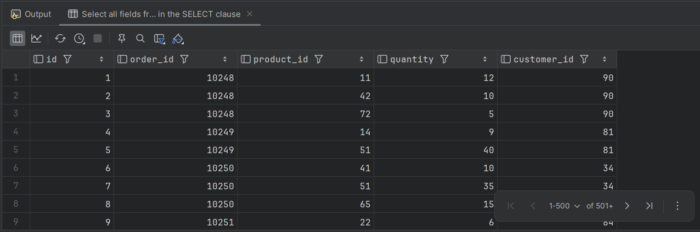
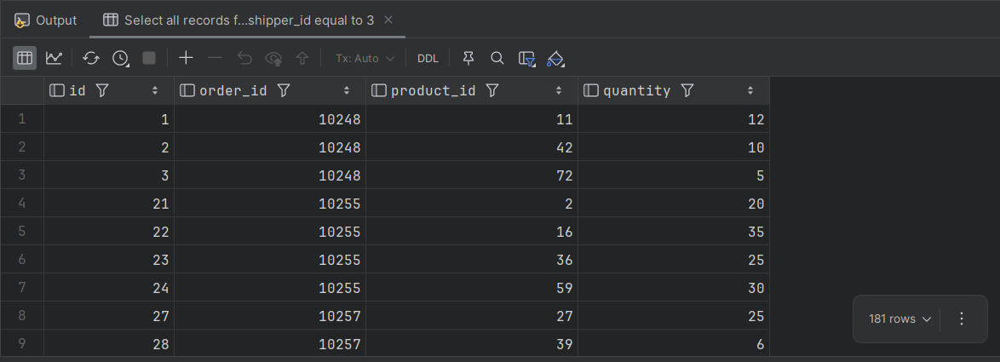
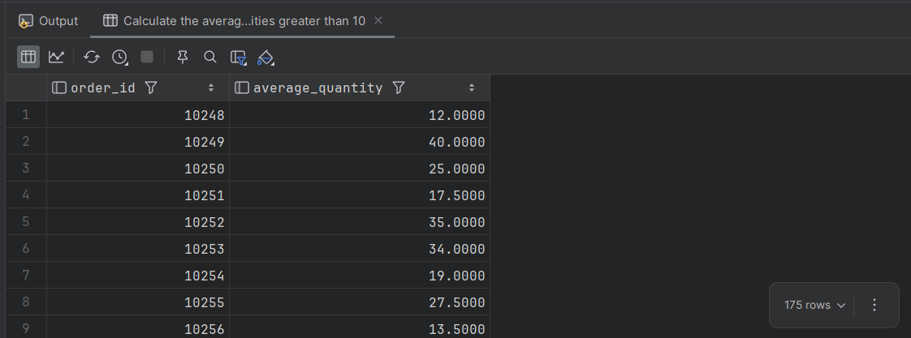
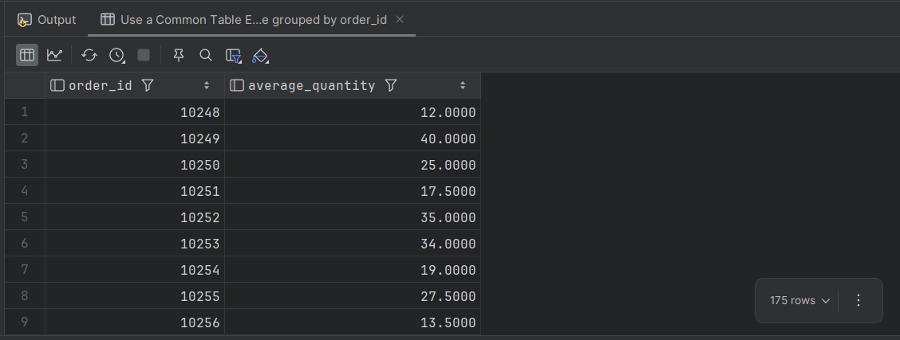
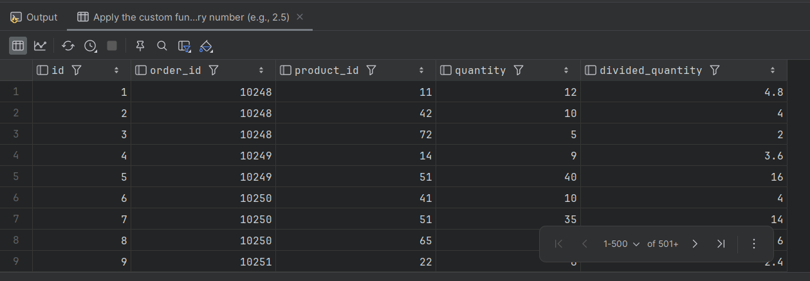

# HW #5: Nested SQL Queries and Code re-usage
This document contains the SQL queries written to solve the homework assignment based on the provided database from the previous [Homework #3](../rdb-hw-03/README.md)

## Task #1
Write an SQL query that will display the `order_details` table and the `customer_id` field from the orders table respectively for each record from the `order_details` table. This must be done using a nested query in the `SELECT` operator.

### Solution:
```sql
SELECT 
    od.id,
    od.order_id,
    od.product_id,
    od.quantity,
    (SELECT o.customer_id FROM orders o WHERE o.id = od.order_id) AS customer_id
FROM 
    order_details od;
```

### Result produced by the query



## Task #2
Write an SQL query that will display the `order_details` table, filtering the results so that the corresponding record from the `orders` table fulfills the condition `shipper_id=3`. This must be done using a nested query in the `WHERE` operator.

### Solution:
```sql
SELECT *
FROM 
    order_details od
WHERE 
    od.order_id IN (
        SELECT o.id 
        FROM orders o 
        WHERE o.shipper_id = 3
    );
```

### Result produced by the query



## Task #3
Write an SQL query nested in the `FROM` operator that will select rows with the condition `quantity>10` from the `order_details` table. For the obtained data, find the average value of the `quantity` field, grouping the results by `order_id`.

### Solution:
```sql
SELECT 
    filtered_orders.order_id,
    AVG(filtered_orders.quantity) AS average_quantity
FROM (
    SELECT * FROM order_details 
    WHERE quantity > 10
) AS filtered_orders
GROUP BY 
    filtered_orders.order_id;
```

### Result produced by the query



## Task #4
Solve task 3 using the `WITH` operator to create a temporary table named `temp`

### Solution:
```sql
WITH temp AS (
    SELECT * FROM order_details 
    WHERE quantity > 10
)
SELECT 
    order_id,
    AVG(quantity) AS average_quantity
FROM 
    temp
GROUP BY 
    order_id;
```

### Result produced by the query



## Task #5
Create a function with two parameters that will divide the first parameter by the second. Both parameters and the returned value must have the `FLOAT` type, and the `DROP FUNCTION IF EXISTS` construction must be used. Apply the function to the `quantity` attribute of the `order_details` table with a second parameter of your choice.

### Solution:
```sql
-- Drop the function if it already exists to prevent creation errors
DROP FUNCTION IF EXISTS divide_values;

-- Change delimiter to create the function (standard syntax for MySQL environments)
DELIMITER //

-- Create a function that takes two FLOAT values and returns their division
CREATE FUNCTION divide_values(numerator FLOAT, denominator FLOAT) 
RETURNS FLOAT
DETERMINISTIC
BEGIN
    -- Prevent division by zero by returning NULL if the denominator is 0
    IF denominator = 0 THEN
        RETURN NULL;
    ELSE
        RETURN numerator / denominator;
    END IF;
END //

DELIMITER ;

-- Apply the custom function to the quantity column, dividing it by an arbitrary number (e.g., 2.5)
SELECT 
    id,
    order_id,
    product_id,
    quantity,
    divide_values(quantity, 2.5) AS divided_quantity
FROM 
    order_details;
```

### Result produced by the query
