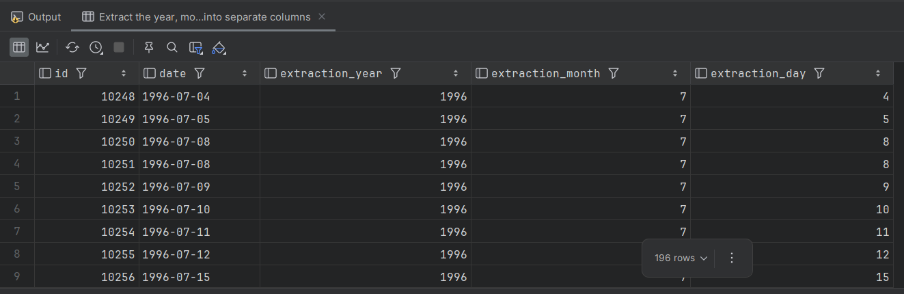
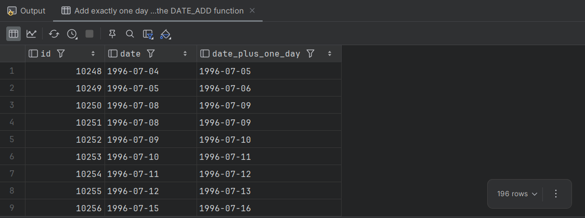
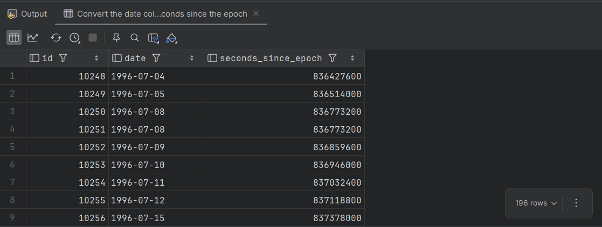
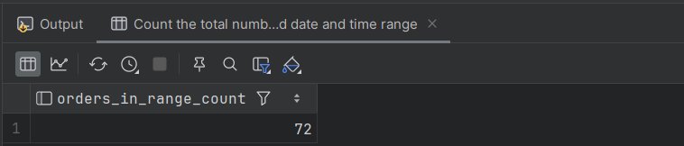
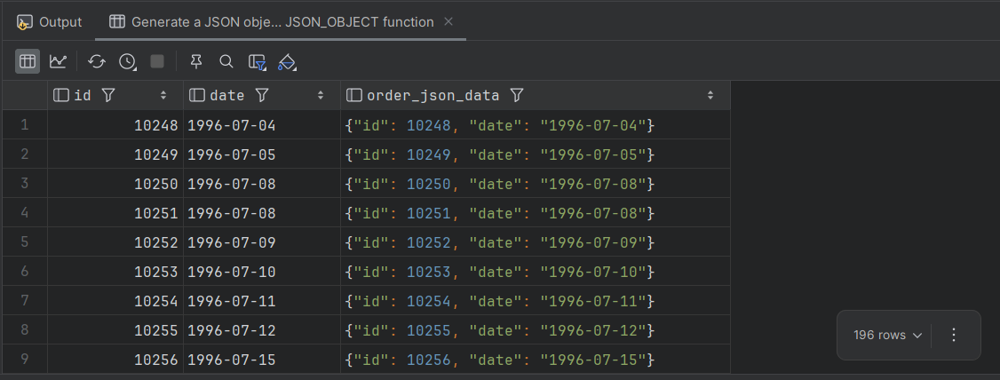

# HW #7: Working with Time and Additional built-in functions
This document contains the SQL queries written to solve the homework assignment based on the provided database from the previous [Homework #3](../rdb-hw-03/README.md)

## Task #1
Write an SQL query that extracts the year, month, and day from the `date` attribute for the `orders` table. Display them in three separate attributes next to the `id` attribute and the original `date` attribute (resulting in 5 attributes in total).

### Solution:
```sql
SELECT 
    id,
    date,
    EXTRACT(YEAR FROM date) AS extraction_year,
    EXTRACT(MONTH FROM date) AS extraction_month,
    EXTRACT(DAY FROM date) AS extraction_day
FROM 
    orders;
```

### Result produced by the query



## Task #2
Write an SQL query that adds one day to the `date` attribute for the `orders` table. Display the `id` attribute, the original `date` attribute, and the result of the addition on the screen.

### Solution:
```sql
SELECT 
    id,
    date,
    DATE_ADD(date, INTERVAL 1 DAY) AS date_plus_one_day
FROM 
    orders;
```

### Result produced by the query



## Task #3
Write an SQL query that displays the number of seconds since the beginning of the epoch (shows its timestamp value) for the `date` attribute in the `orders` table. You need to find and apply the necessary function for this, then display the `id` attribute, the original `date` attribute, and the result of the function.

### Solution:
```sql
SELECT 
    id,
    date,
    UNIX_TIMESTAMP(date) AS seconds_since_epoch
FROM 
    orders;
```

### Result produced by the query



## Task #4
Write an SQL query that counts how many rows the `orders` table contains with a `date` attribute between `1996-07-10 00:00:00` and `1996-10-08 00:00:00`.

### Solution:
```sql
SELECT 
    COUNT(*) AS orders_in_range_count
FROM 
    orders
WHERE 
    date BETWEEN '1996-07-10 00:00:00' AND '1996-10-08 00:00:00';
```

### Result produced by the query



## Task #5
Write an SQL query that displays the `id` attribute, the date attribute, and a JSON object `{"id": <row id attribute>, "date": <row date attribute>}` for the `orders` table. Use a function to create the JSON object.

### Solution:
```sql
SELECT 
    id,
    date,
    JSON_OBJECT('id', id, 'date', date) AS order_json_data
FROM 
    orders;
```

### Result produced by the query
